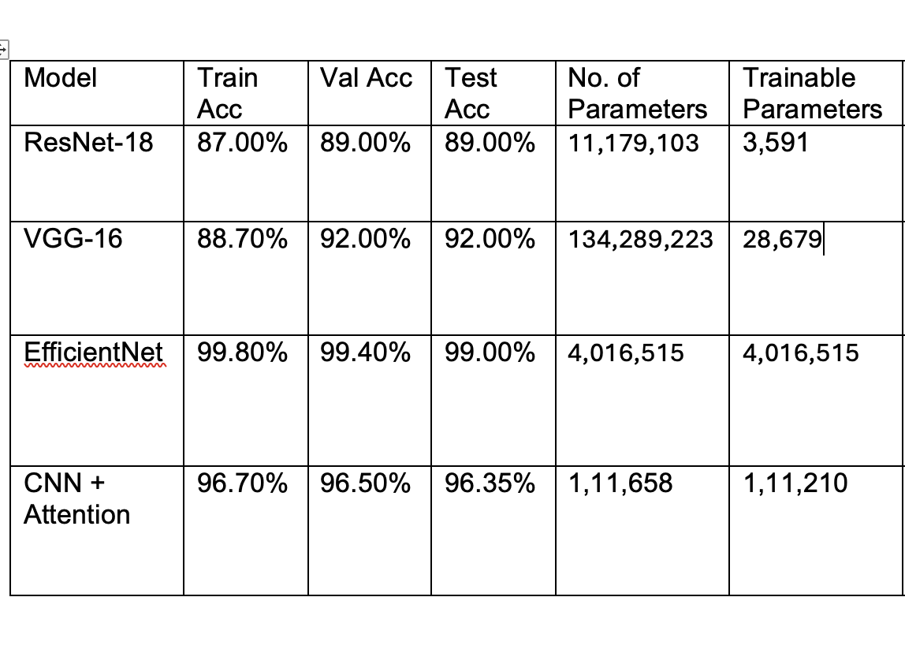

# Underwater Gesture Recognition using Deep Learning

This project explores the classification of underwater hand gestures using various Convolutional Neural Network (CNN) architectures. The goal is to accurately identify 7 distinct gestures, which can be crucial for applications like diver-to-diver communication, underwater robotics, and autonomous underwater vehicle (AUV) control.

## Table of Contents
- [Project Overview](#project-overview)
- [Dataset](#dataset)
- [Models Implemented](#models-implemented)
- [Performance Comparison](#performance-comparison)
- [Getting Started](#getting-started)
  - [Prerequisites](#prerequisites)
  - [Installation](#installation)
- [Usage](#usage)
- [Folder Structure](#folder-structure)
- [Contributing](#contributing)

## Project Overview

Effective communication underwater is a significant challenge. Hand gestures are a primary method of communication for divers, but visibility and environmental conditions can make them difficult to interpret. This project leverages deep learning to build a robust image classification system that can recognize 7 key underwater hand gestures. We experiment with several CNN models, from a custom architecture to well-established pretrained models like VGG-16, ResNet-18, and EfficientNet-B0, to find the most effective approach.

## Dataset

The project utilizes a custom dataset of underwater gesture images.

- **Classes:** The dataset is categorized into 7 gesture classes: `stop`, `three`, `one`, `up`, `two`, `four`, and `down`.
- **Size:** The dataset contains a total of 7,850 images.
- **Splits:** The data is split into training (70%), validation (15%), and testing (15%) sets to ensure proper model evaluation.

The notebooks demonstrate techniques to handle class imbalance, such as using `WeightedRandomSampler` in PyTorch, to prevent the model from being biased towards more frequent classes.

## Models Implemented

Four different models were implemented and evaluated to compare their performance on this specific task:

1.  **Custom CNN with Attention (`MY_MTP(CNN_+_Attention).ipynb`)**
    -   **Framework:** TensorFlow/Keras
    -   **Architecture:** A custom-built CNN featuring multiple convolutional blocks, batch normalization, and dropout layers. A **Spatial Attention** mechanism is integrated to help the model focus on the most relevant parts of the image (i.e., the hand gesture).
    -   **Test Accuracy:** 96.35%

2.  **VGG-16 (`MY_MTP(VGG_16).ipynb`)**
    -   **Framework:** PyTorch
    -   **Architecture:** A pretrained VGG-16 model, fine-tuned for the gesture classification task. The final layers of the network were unfrozen and retrained on the gesture dataset.
    -   **Test Accuracy:** 92.06% (Note: A second training run with more unfrozen layers and class weighting achieved 99.83% validation accuracy, suggesting potential for even higher test performance.)

3.  **ResNet-18 (`MY_MTP(ResNet_18).ipynb`)**
    -   **Framework:** PyTorch
    -   **Architecture:** A pretrained ResNet-18 model, fine-tuned by replacing the final fully connected layer and training it on the underwater gesture dataset.
    -   **Test Accuracy:** 89.19%

4.  **EfficientNet-B0 (`MY_MTP(efficientnet).ipynb`)**
    -   **Framework:** PyTorch
    -   **Architecture:** A pretrained EfficientNet-B0 model, known for its high efficiency and performance. The model was fine-tuned for this specific task.
    -   **Test Accuracy:** **99.41%**

## Performance Comparison

The models were evaluated based on their test accuracy. The results clearly indicate that the **EfficientNet-B0** model outperformed the others, achieving an impressive **99.41%** accuracy on the test set.



The custom CNN with an attention mechanism also performed very well, demonstrating the effectiveness of attention in focusing the model on the hand gesture. While VGG-16 and ResNet-18 are powerful architectures, EfficientNet's modern design proves to be superior for this task.

## Getting Started

To run these experiments on your own machine, please follow the instructions below.

### Prerequisites

The notebooks were run in a Google Colab environment. The primary dependencies are:

- Python 3.x
- TensorFlow / Keras (for the Custom CNN with Attention model)
- PyTorch (for VGG-16, ResNet-18, and EfficientNet models)
- Scikit-learn
- NumPy
- Matplotlib
- Seaborn
- tqdm
- Kaggle Hub (for the EfficientNet notebook)

### Installation

1.  **Clone the repository:**
    ```bash
    git clone <repository-url>
    cd <repository-directory>
    ```

2.  **Install dependencies:**
    It is recommended to use a virtual environment.
    ```bash
    pip install tensorflow numpy scikit-learn matplotlib seaborn torch torchvision tqdm kagglehub
    ```

3.  **Dataset:**
    The notebooks expect the dataset to be available. The `MY_MTP(CNN_+_Attention).ipynb` notebook expects a `Underwater_Gesture_Images.zip` file, while the others load data from Google Drive or Kaggle. Please adjust the data loading paths in the notebooks to match your setup.

## Usage

Each Jupyter notebook (`.ipynb` file) corresponds to one of the models. You can open and run the cells in each notebook to train and evaluate the models.

-   `MY_MTP(CNN_+_Attention).ipynb`
-   `MY_MTP(VGG_16).ipynb`
-   `MY_MTP(efficientnet).ipynb`
-   `MY_MTP(ResNet_18).ipynb`

Make sure to update any file paths for loading the dataset or saving models to match your local environment.

## Folder Structure

```
.
├── MY_MTP(CNN_+_Attention).ipynb  # Notebook for the Custom CNN with Attention model
├── MY_MTP(VGG_16).ipynb           # Notebook for the VGG-16 model
├── MY_MTP(efficientnet).ipynb     # Notebook for the EfficientNet-B0 model
├── MY_MTP(ResNet_18).ipynb        # Notebook for the ResNet-18 model
├── Comparision-table.png          # Image comparing model performance
└── README.md                      # This file
```

## Contributing

Contributions are welcome! If you have ideas for improvements, please open an issue or submit a pull request.
